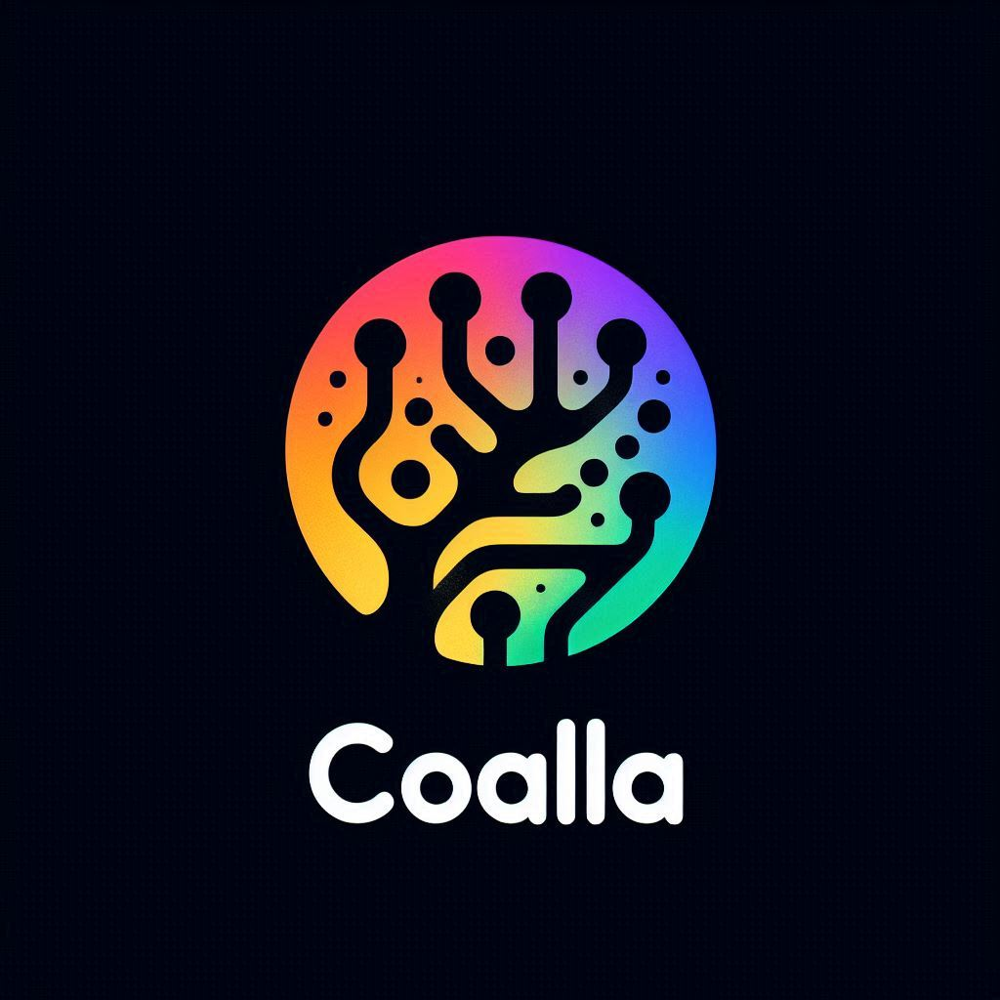

# 🌍🧙space coalla 🧙🌍


### 🌱 Technologies Used

- **C**: Implementing critical functionalities and high-performance components.
- **Java**: Developing robust applications and managing business logic.
- **Node.js**: Managing backend operations and communication with the frontend.
- **Shell Script**: Automating tasks and integrating systems.
- **Rubyx**: Scripting and developing supporting tools.
- **Lua**: Lightweight scripting and extensibility.
- **Go**: Developing efficient and scalable services.

### 🌟 Description

**NSC Coalla AI** is an innovative platform by HoloFi designed for the development of decentralized applications (DApps) and digital asset management. By integrating advanced technologies, Coalla AI provides secure and efficient solutions for tokenization, transactions, and smart contract operations.

### 🛠️ Prerequisites

- Compilers for **C** and **Java** installed on your machine.
- **Node.js** and **npm** installed for managing JavaScript dependencies and running the backend.
- **Rubyx** and **Lua** installed for scripting and automation.
- **Shell** environment set up for running scripts and automated tasks.
- **Go** configured for service development.
- Basic knowledge of C, Java, Node.js, Shell, Rubyx, Lua, and Go.

### 🚀 Instructions for Use

1. **Cloning the Repository:**
   ```sh
   git clone https://github.com/your-username/nsc-coalla-ai.git
   ```

2. **Installing Dependencies:**
   ```sh
   cd nsc-coalla-ai
   npm install
   ```

3. **Configuring the NSC Coalla AI Network:**
   - Ensure your NSC Coalla AI client is operational and synced.
   - Set up environment variables in the `.env` file with the details of your HoloFi network.

4. **Deploying Smart Contracts:**
   - Compile and deploy smart contracts on the HoloFi network as needed.
   - Update contract addresses in configuration files (`config.js`, etc.) after deployment.

5. **Building the Node.js Frontend:**
   ```sh
   npm run build
   ```

6. **Running the DApp:**
   ```sh
   npm start
   ```

7. **Interacting with the NSC Coalla AI DApp:**
   - Use the provided REST API endpoints to manage digital assets and execute transactions.
   - Digital assets are represented as customizable tokens on the HoloFi network.

### 🌌 Planetary Integration

NSC Coalla AI is designed to provide advanced functionalities focusing on security, transparency, and computational efficiency for DApps, encompassing both Earth and Space.

### ⚛️ Quantum Computing and Hybrid Asset Creation

The platform integrates innovative solutions for creating hybrid digital assets and quantum computing, expanding the possibilities for decentralized applications and digital asset management.

### 🔧 New Configurations

- **Environment Configuration Update**: Include the latest environment variables related to HORIZON FX capabilities and quantum integration in your `.env` file.
- **New Dependencies**: Added support for quantum integration libraries and updates to Horigami FX.

### 📜 License

This project is licensed under the Apache-2.0 License. See the [LICENSE](LICENSE) file for details.

**NSC Coalla AI** is at the forefront of HoloFi technology, providing a robust platform for decentralized applications and digital asset management. With advanced integrations such as planetary functionalities and quantum computing capabilities, Coalla AI is ready to redefine the HoloFi landscape.

<p>FOUNDER: LUCAS JANAURIO DO NASCIMENTO</p>



---

Thank you for your attention!
